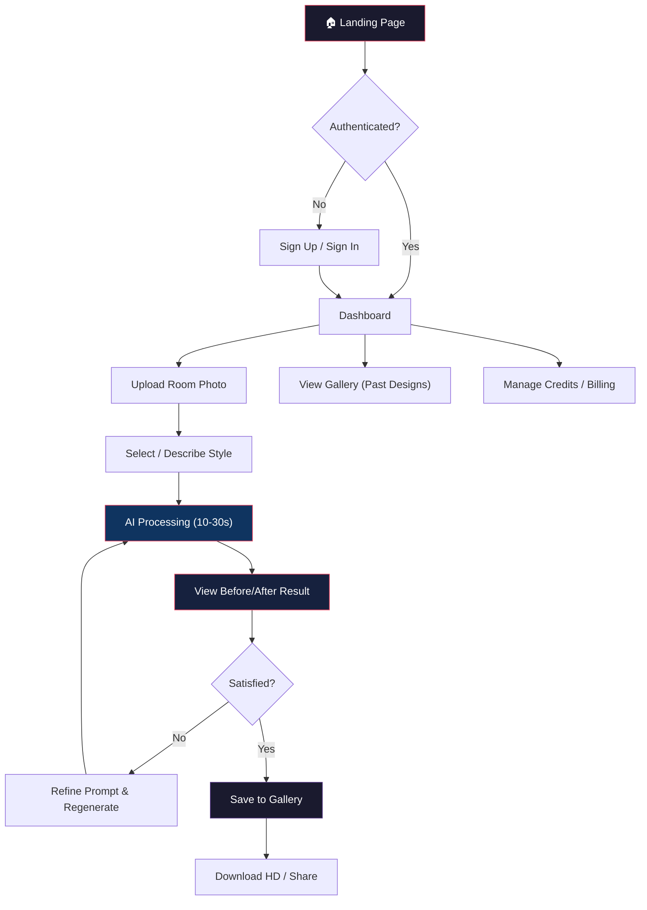
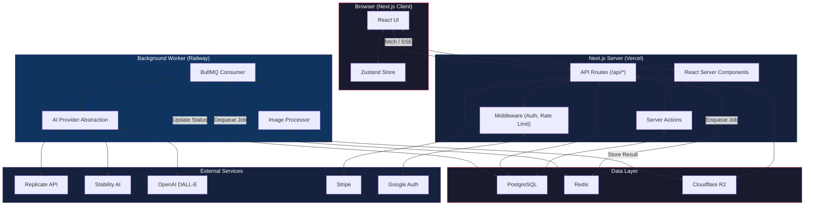
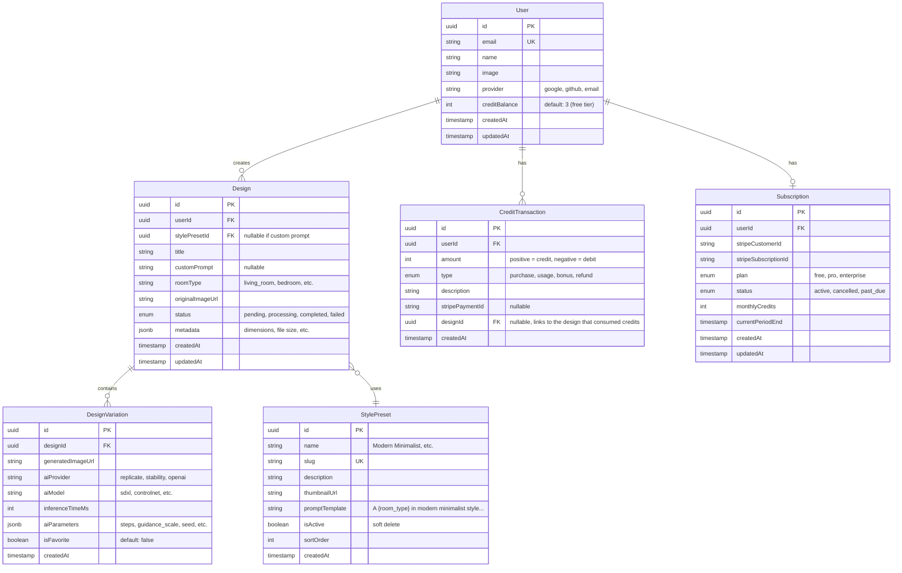
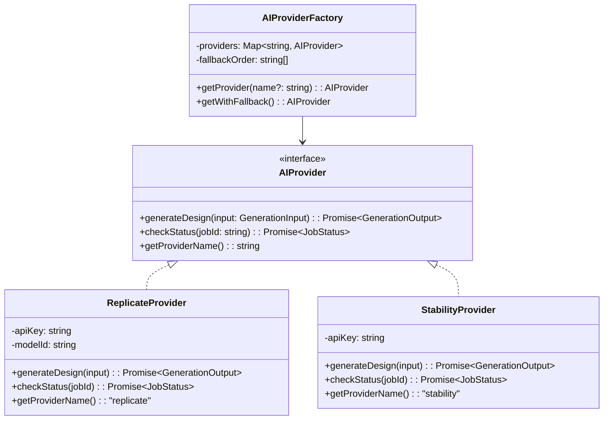
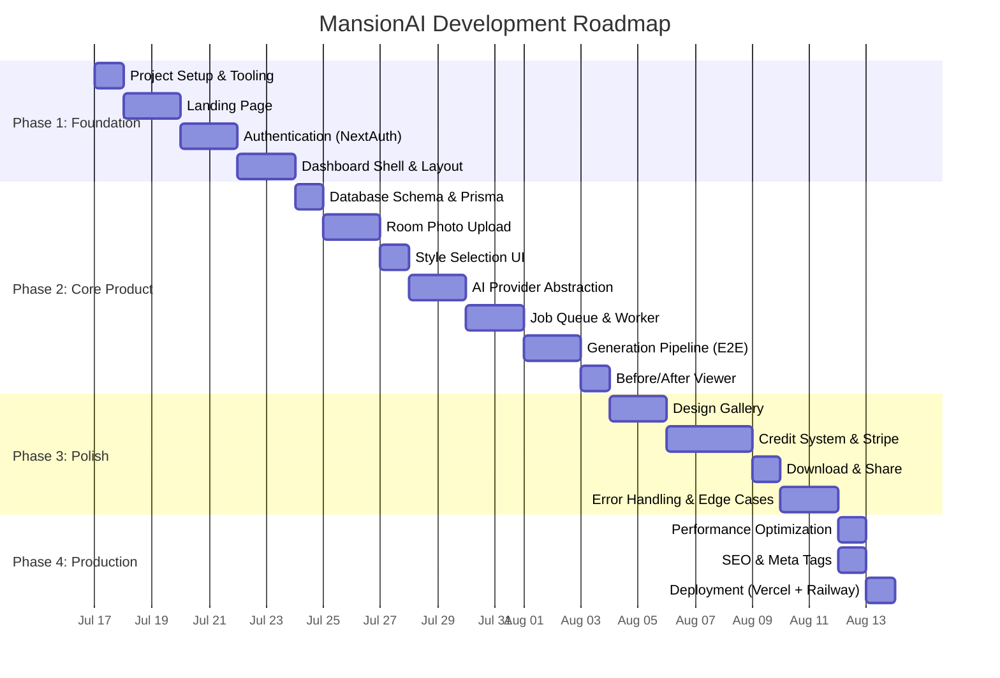
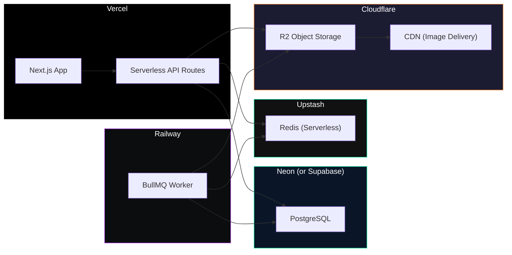

# MansionAI — Product Blueprint

> An AI-powered interior design platform that transforms any room photo into a photorealistic redesign using natural language prompts.

---

## 1. Product Vision

**One-liner**: *"Redesign any room in seconds with AI — no designer needed."*

MansionAI lets users upload a photo of their room, choose or describe a style, and receive a photorealistic AI-generated redesign. It democratizes interior design, making it accessible to anyone with a smartphone.

### Why this product matters architecturally

This isn't a CRUD app. It touches nearly every domain a modern full-stack engineer needs to master:

| Domain | What You'll Learn |
|---|---|
| **Async Processing** | AI image generation takes 10-60 seconds. You can't block an HTTP request for that long. You'll build a job queue. |
| **File Handling** | Uploading, storing, resizing, and serving images at scale (S3/R2, signed URLs, CDN). |
| **AI Abstraction** | Wrapping multiple AI providers behind a single interface (Strategy Pattern). Provider-agnostic code. |
| **Payments** | Stripe integration with credit-based billing (metered usage, not just subscriptions). |
| **Real-time UX** | Polling or SSE to show generation progress ("Analyzing room… Applying style… Rendering…"). |
| **Auth & Multi-tenancy** | User accounts, session management, protecting API routes. |
| **Production UX** | Loading states, error boundaries, optimistic UI, skeleton screens, responsive design. |

---

## 2. Target Audience

### Primary Personas

| Persona | Pain Point | How MansionAI Helps |
|---|---|---|
| **Homeowner (25-45)** | "I want to renovate my living room but can't visualize the result." | Upload a photo → see 5 different styles before spending money. |
| **Renter** | "I want to make my apartment feel like mine but I can't make permanent changes." | See furniture/decor changes that don't require renovation. |
| **Real Estate Agent** | "Empty rooms don't sell. Staging is expensive ($2-5K per room)." | Virtual staging in seconds for a fraction of the cost. |
| **Interior Design Student** | "I need to present concepts to clients quickly." | Rapid prototyping tool for client presentations. |

### Why personas matter (engineering lesson)

> [!IMPORTANT]
> Personas aren't just a product exercise. They drive **technical decisions**:
> - Real estate agents upload 20+ photos per listing → we need **batch processing**.
> - Renters are price-sensitive → we need a **generous free tier** with credit-based billing.
> - Design students need high-res exports → we need **multiple output resolutions**.
> 
> Every feature you build should map back to a persona's need. This prevents scope creep.

---

## 3. User Journey



### Key UX States (often ignored by junior engineers)

Every screen in the app has **5 states** that must be designed:

| State | Example |
|---|---|
| **Empty** | Dashboard with no designs yet → show onboarding CTA |
| **Loading** | AI is generating → show skeleton + progress animation |
| **Partial** | 2 of 4 variations are done → show them progressively |
| **Error** | AI provider is down → graceful fallback message + retry |
| **Success** | Generation complete → before/after slider |

> [!TIP]
> **Senior engineering insight**: Most bugs users report are not logic bugs — they're **missing state handling**. A button that doesn't disable after click, a spinner that never stops, a blank screen with no message. Handling all 5 states is what separates production apps from demos.

---

## 4. Core Features (MVP)

These are the features we will build, in order, for the first release:

### Phase 1: Foundation
| # | Feature | Engineering Concepts |
|---|---|---|
| 1 | **Landing Page** | Static page, responsive layout, animation, SEO |
| 2 | **Authentication** | NextAuth.js, OAuth providers, session management, middleware |
| 3 | **Dashboard Shell** | Layout system, sidebar navigation, protected routes |

### Phase 2: Core Product
| # | Feature | Engineering Concepts |
|---|---|---|
| 4 | **Room Upload** | File validation, client-side compression, S3 presigned URLs, drag-and-drop |
| 5 | **Style Selection** | Predefined style presets + free-text prompt input |
| 6 | **AI Generation Pipeline** | Job queue (BullMQ), AI provider abstraction, polling/SSE for progress |
| 7 | **Before/After Viewer** | Image comparison slider, zoom, pan |

### Phase 3: User Experience
| # | Feature | Engineering Concepts |
|---|---|---|
| 8 | **Design Gallery** | Infinite scroll, masonry grid, image lazy loading |
| 9 | **Credit System** | Metered billing, Stripe integration, usage tracking |
| 10 | **Download & Share** | Watermarking (free tier), HD export (paid), Open Graph share cards |

---

## 5. Future Features (Post-MVP)

These are listed to show you the **growth trajectory** but we will NOT build them now. Listing them ensures our architecture doesn't paint us into a corner.

| Feature | Why it matters architecturally |
|---|---|
| **Batch Processing** | Tests our queue system under load. Multiple jobs per request. |
| **Room Type Detection** | AI classifies the room (kitchen, bedroom, etc.) to suggest relevant styles. |
| **Furniture Catalog Integration** | "Buy this exact sofa" → affiliate revenue. Requires a product database. |
| **Collaborative Projects** | Multiple users on one project → needs authorization model (RBAC). |
| **Mobile App (React Native)** | Our API-first architecture makes this trivial later. |
| **AI Fine-tuning Dashboard** | Let power users train custom style models. |

> [!NOTE]
> **Why list future features now?** Because it changes how we design our database schema and API contracts. For example, knowing we'll add "Collaborative Projects" later means our `Design` table should have a `project_id` foreign key from day one, even if we don't expose projects in the UI yet. This is called **forward-compatible design**.

---

## 6. Technical Architecture

### 6.1 Technology Stack

| Layer | Technology | Why This Over Alternatives |
|---|---|---|
| **Framework** | **Next.js 15 (App Router)** | Server Components reduce client JS bundle. API routes colocated with frontend. Vercel-native deployment. *Alternative: Vite + Express — more flexible but requires managing two deployments.* |
| **Language** | **TypeScript** | Type safety catches bugs at compile time, not production. Self-documenting code. Non-negotiable for production apps. |
| **Styling** | **Tailwind CSS v4** | Utility-first CSS scales better in teams than CSS modules. JIT compiler = zero unused CSS. *Alternative: Vanilla CSS — more control but slower iteration.* |
| **State Management** | **Zustand** | Minimal API, no boilerplate (unlike Redux). Works seamlessly with React Server Components. *Alternative: Jotai — atomic model is great but Zustand's simplicity wins for this project.* |
| **Database** | **PostgreSQL** | Battle-tested relational DB. JSONB for flexible metadata. `pgvector` extension available for future semantic search. |
| **ORM** | **Prisma** | Type-safe database queries that auto-generate TypeScript types from your schema. Migrations built-in. *Alternative: Drizzle — lighter, closer to SQL, but Prisma's DX is better for learning.* |
| **Auth** | **NextAuth.js v5 (Auth.js)** | First-party Next.js integration. Supports Google, GitHub OAuth + email/password. Session management out of the box. *Alternative: Clerk — better UX but adds a SaaS dependency and cost.* |
| **Job Queue** | **BullMQ + Redis** | Industry-standard for Node.js background jobs. Retries, priorities, rate limiting, dead-letter queues. *Alternative: pg-boss — uses Postgres instead of Redis, simpler but less battle-tested.* |
| **File Storage** | **Cloudflare R2** | S3-compatible API with zero egress fees. *Alternative: AWS S3 — industry standard but egress costs add up fast.* |
| **Payments** | **Stripe** | The gold standard for SaaS billing. Credit-based metered billing with Stripe Billing. |
| **AI Providers** | **Replicate (primary), Stability AI, OpenAI (fallback)** | Replicate hosts open-source models (ControlNet, SDXL) with a simple API. We abstract over all providers. |
| **Deployment** | **Vercel (frontend) + Railway (worker)** | Vercel for Next.js is zero-config. Railway for the BullMQ worker process. *Alternative: Single VPS — cheaper but you manage everything.* |

### 6.2 System Architecture Diagram



### 6.3 Why Separate the Worker?

> [!IMPORTANT]
> **Architectural Decision: Decoupled Worker Process**
> 
> The AI generation takes 10-60 seconds. If we processed it inside an API route:
> 1. **Vercel has a 10s timeout** on serverless functions (60s on Pro). Our job would be killed.
> 2. **Blocking a server thread** means fewer concurrent users can be served.
> 3. **No retry logic** — if the AI provider fails mid-generation, the user gets nothing.
> 
> By decoupling:
> - The API route **enqueues a job** to Redis (< 50ms) and returns immediately.
> - The worker **dequeues and processes** the job with retries, timeouts, and error handling.
> - The client **polls for status** via a lightweight GET endpoint or receives SSE updates.
> 
> **Tradeoff**: This adds infrastructure complexity (Redis + Worker). For a hackathon, you'd skip this. For production, it's mandatory.

---

## 7. Folder Structure

```
mansion-ai/
├── src/
│   ├── app/                          # Next.js App Router (pages & layouts)
│   │   ├── (marketing)/              # Route group: public pages
│   │   │   ├── page.tsx              # Landing page
│   │   │   ├── pricing/
│   │   │   │   └── page.tsx
│   │   │   └── layout.tsx            # Marketing layout (navbar + footer)
│   │   │
│   │   ├── (dashboard)/              # Route group: authenticated pages
│   │   │   ├── dashboard/
│   │   │   │   └── page.tsx          # Main dashboard
│   │   │   ├── design/
│   │   │   │   ├── new/
│   │   │   │   │   └── page.tsx      # New design flow
│   │   │   │   └── [id]/
│   │   │   │       └── page.tsx      # View single design
│   │   │   ├── gallery/
│   │   │   │   └── page.tsx          # User's design gallery
│   │   │   ├── billing/
│   │   │   │   └── page.tsx          # Credits & subscription
│   │   │   └── layout.tsx            # Dashboard layout (sidebar)
│   │   │
│   │   ├── api/                      # API Routes
│   │   │   ├── auth/
│   │   │   │   └── [...nextauth]/
│   │   │   │       └── route.ts      # NextAuth catch-all
│   │   │   ├── designs/
│   │   │   │   ├── route.ts          # POST: create, GET: list
│   │   │   │   └── [id]/
│   │   │   │       ├── route.ts      # GET: status, DELETE
│   │   │   │       └── status/
│   │   │   │           └── route.ts  # GET: poll generation status
│   │   │   ├── upload/
│   │   │   │   └── route.ts          # POST: get presigned URL
│   │   │   ├── credits/
│   │   │   │   └── route.ts          # GET: balance
│   │   │   └── webhooks/
│   │   │       └── stripe/
│   │   │           └── route.ts      # POST: Stripe webhook handler
│   │   │
│   │   ├── layout.tsx                # Root layout
│   │   ├── globals.css               # Global styles + Tailwind directives
│   │   └── not-found.tsx             # Custom 404 page
│   │
│   ├── components/                   # Reusable UI components
│   │   ├── ui/                       # Primitive/atomic components
│   │   │   ├── button.tsx
│   │   │   ├── card.tsx
│   │   │   ├── input.tsx
│   │   │   ├── modal.tsx
│   │   │   ├── skeleton.tsx
│   │   │   ├── badge.tsx
│   │   │   ├── tooltip.tsx
│   │   │   └── slider.tsx            # Before/after image slider
│   │   │
│   │   ├── layout/                   # Layout components
│   │   │   ├── navbar.tsx
│   │   │   ├── sidebar.tsx
│   │   │   ├── footer.tsx
│   │   │   └── mobile-nav.tsx
│   │   │
│   │   ├── features/                 # Feature-specific components
│   │   │   ├── upload/
│   │   │   │   ├── dropzone.tsx
│   │   │   │   └── upload-preview.tsx
│   │   │   ├── design/
│   │   │   │   ├── style-picker.tsx
│   │   │   │   ├── prompt-input.tsx
│   │   │   │   ├── generation-progress.tsx
│   │   │   │   └── design-card.tsx
│   │   │   ├── gallery/
│   │   │   │   └── masonry-grid.tsx
│   │   │   └── billing/
│   │   │       ├── credit-badge.tsx
│   │   │       └── pricing-card.tsx
│   │   │
│   │   └── shared/                   # Cross-cutting components
│   │       ├── error-boundary.tsx
│   │       ├── empty-state.tsx
│   │       └── page-header.tsx
│   │
│   ├── lib/                          # Core business logic & utilities
│   │   ├── ai/                       # AI Provider Abstraction
│   │   │   ├── types.ts              # Shared interfaces
│   │   │   ├── provider.ts           # Abstract base / interface
│   │   │   ├── replicate.ts          # Replicate implementation
│   │   │   ├── stability.ts          # Stability AI implementation
│   │   │   └── factory.ts            # Provider factory (Strategy Pattern)
│   │   │
│   │   ├── db/                       # Database layer
│   │   │   ├── prisma.ts             # Prisma client singleton
│   │   │   └── queries/              # Reusable query functions
│   │   │       ├── designs.ts
│   │   │       ├── users.ts
│   │   │       └── credits.ts
│   │   │
│   │   ├── storage/                  # File storage abstraction
│   │   │   ├── types.ts
│   │   │   ├── r2.ts                 # Cloudflare R2 implementation
│   │   │   └── local.ts             # Local filesystem (dev only)
│   │   │
│   │   ├── queue/                    # Job queue
│   │   │   ├── client.ts             # BullMQ queue instance
│   │   │   ├── jobs.ts               # Job type definitions
│   │   │   └── handlers/             # Job processors
│   │   │       └── generate-design.ts
│   │   │
│   │   ├── stripe/                   # Stripe integration
│   │   │   ├── client.ts
│   │   │   ├── products.ts           # Credit package definitions
│   │   │   └── webhooks.ts           # Webhook event handlers
│   │   │
│   │   ├── auth/                     # Auth configuration
│   │   │   ├── config.ts             # NextAuth config
│   │   │   └── guards.ts             # Auth helper functions
│   │   │
│   │   └── utils/                    # Pure utility functions
│   │       ├── cn.ts                 # className merger (clsx + twMerge)
│   │       ├── format.ts             # Date, number formatters
│   │       └── constants.ts          # App-wide constants
│   │
│   ├── hooks/                        # Custom React hooks
│   │   ├── use-design-status.ts      # Poll/SSE for generation progress
│   │   ├── use-upload.ts             # Upload with progress tracking
│   │   ├── use-credits.ts            # Credit balance hook
│   │   └── use-media-query.ts        # Responsive breakpoint hook
│   │
│   ├── stores/                       # Zustand state stores
│   │   ├── design-store.ts           # Current design session state
│   │   └── ui-store.ts               # UI state (sidebar, modals)
│   │
│   └── types/                        # Shared TypeScript types
│       ├── design.ts
│       ├── user.ts
│       └── api.ts                    # API request/response types
│
├── worker/                           # Background worker (separate process)
│   ├── index.ts                      # Worker entry point
│   ├── processors/
│   │   └── design-processor.ts       # AI generation logic
│   └── package.json                  # Worker-specific dependencies
│
├── prisma/
│   ├── schema.prisma                 # Database schema
│   └── migrations/                   # Auto-generated migrations
│
├── public/
│   ├── images/
│   │   ├── styles/                   # Style preset thumbnails
│   │   └── og/                       # Open Graph images
│   └── fonts/                        # Self-hosted fonts
│
├── .env.example                      # Environment variable template
├── .env.local                        # Local env (git-ignored)
├── next.config.ts
├── tailwind.config.ts
├── tsconfig.json
├── package.json
└── README.md
```

### Why this structure?

> [!NOTE]
> **Folder Structure Philosophy: Feature-Sliced + Clean Architecture**
> 
> This structure follows two principles:
> 
> **1. Separation by layer** (`components/`, `lib/`, `hooks/`, `stores/`, `types/`):
> Each directory has a single responsibility. `components/` never imports from `stores/` directly — it goes through `hooks/`. `lib/` never imports from `components/`. Dependencies flow **inward** (UI → Hooks → Lib → DB).
> 
> **2. Feature grouping within layers** (`components/features/upload/`, `lib/ai/`):
> Within each layer, related files are grouped by feature domain. This means when you work on the "upload" feature, all related components are in one folder, not scattered across the tree.
> 
> **Why not group everything by feature?** (e.g., `features/upload/components/`, `features/upload/hooks/`):
> Feature-folder structures work well at scale (50+ features), but at our size, they create deep nesting and make shared components hard to find. The hybrid approach gives us colocation benefits without the overhead.

---

## 8. Database Schema



### Schema Design Decisions

**1. Why `DesignVariation` is separate from `Design`**

A single design request can produce multiple variations (e.g., 4 outputs from one prompt). Storing each variation separately means:
- Users can favorite individual variations.
- We track which AI provider/model generated each one (useful for quality comparison).
- We can add "regenerate one variation" without re-running the entire batch.

If we embedded variations as a JSON array in `Design`, we'd lose the ability to query, index, and paginate individual variations efficiently.

**2. Why `CreditTransaction` uses a ledger pattern**

> [!IMPORTANT]
> **Ledger Pattern vs. Simple Balance Field**
> 
> We could just have `User.creditBalance` and increment/decrement it. But this creates two problems:
> 1. **No audit trail**: If a user says "I was charged twice," you can't prove otherwise.
> 2. **Race conditions**: Two concurrent requests could both read `balance = 5`, both deduct 1, and write `balance = 4` instead of `3`.
> 
> The **ledger pattern** records every transaction as an immutable row. The balance is the `SUM(amount)` of all transactions. This is how every payment system (Stripe, banks) works.
> 
> We keep `User.creditBalance` as a **denormalized cache** for fast reads, but the ledger is the source of truth.

**3. Why `jsonb metadata` instead of more columns**

Fields like image dimensions, file size, EXIF data, and processing metadata are:
- Read-only after creation
- Not used in WHERE clauses or JOINs
- Variable in structure across AI providers

JSONB gives us flexibility without schema migrations for every new metadata field. If we later need to query on a JSONB field, PostgreSQL supports JSONB indexing via GIN indexes.

**4. Forward-compatible fields**

- `Design.roomType` → Enables future room-type-based style recommendations.
- `DesignVariation.aiProvider` / `aiModel` → Enables future A/B testing across providers.
- `DesignVariation.aiParameters` → Enables "recreate with same settings" feature.

---

## 9. API Architecture

### RESTful API Design

| Method | Endpoint | Description | Auth | Rate Limit |
|---|---|---|---|---|
| `POST` | `/api/upload` | Get presigned upload URL | ✅ | 10/min |
| `POST` | `/api/designs` | Create new design (enqueue job) | ✅ | 5/min |
| `GET` | `/api/designs` | List user's designs (paginated) | ✅ | 30/min |
| `GET` | `/api/designs/[id]` | Get single design with variations | ✅ | 60/min |
| `GET` | `/api/designs/[id]/status` | Poll generation status | ✅ | 120/min |
| `DELETE` | `/api/designs/[id]` | Soft delete a design | ✅ | 10/min |
| `GET` | `/api/credits` | Get current credit balance | ✅ | 60/min |
| `POST` | `/api/credits/purchase` | Create Stripe checkout session | ✅ | 5/min |
| `GET` | `/api/styles` | List available style presets | ❌ | 30/min |
| `POST` | `/api/webhooks/stripe` | Handle Stripe events | ❌* | — |

*\* Stripe webhooks use signature verification instead of session auth.*

### API Response Contract

Every API response follows a consistent envelope:

```typescript
// Success
{
  "success": true,
  "data": { /* payload */ },
  "meta": {
    "page": 1,
    "pageSize": 20,
    "totalCount": 47,
    "totalPages": 3
  }
}

// Error
{
  "success": false,
  "error": {
    "code": "INSUFFICIENT_CREDITS",
    "message": "You need at least 1 credit to generate a design.",
    "details": { "required": 1, "available": 0 }
  }
}
```

### Why a consistent envelope?

> [!TIP]
> **Senior engineering insight**: Without an envelope, every API consumer has to check:
> - Is the response a 200? Then the body is the data.
> - Is it a 400? Then the body might be `{ error: "..." }` or `{ message: "..." }` or just a string.
> 
> With an envelope, the client can write ONE response handler:
> ```typescript
> const res = await api.get('/designs');
> if (!res.success) {
>   showError(res.error.message); // Always exists on errors
>   return;
> }
> setDesigns(res.data); // Always exists on success
> ```
> 
> This eliminates an entire class of frontend bugs.

### Status Polling vs SSE vs WebSockets

| Approach | Pros | Cons | When to use |
|---|---|---|---|
| **Polling** | Simple, stateless, works everywhere | Wastes bandwidth, slight delay | ✅ **Our choice for MVP** |
| **SSE (Server-Sent Events)** | Real-time, server-push, simple protocol | One-directional, limited browser connections | Phase 2 upgrade |
| **WebSockets** | Bi-directional, real-time | Complex, stateful, scaling challenges | Overkill for this use case |

**Our decision**: Start with polling (every 2 seconds while status is `processing`). It's simple, stateless, and works on every deployment platform. We'll upgrade to SSE when we need real-time progress bars ("40% complete...").

---

## 10. AI Provider Abstraction

### The Problem

AI providers have wildly different APIs:

```
Replicate:   POST /v1/predictions → poll for result
Stability:   POST /v2beta/stable-image/generate → returns image bytes
OpenAI:      POST /v1/images/edits → returns base64 or URL
```

If we hardcode Replicate calls throughout our codebase, switching providers requires rewriting everywhere. When Replicate has an outage, our entire product goes down.

### The Solution: Strategy Pattern



```typescript
// Simplified interface (conceptual, not final code)
interface AIProvider {
  generateDesign(input: {
    originalImageUrl: string;
    prompt: string;
    style: string;
    options?: {
      steps?: number;
      guidanceScale?: number;
      seed?: number;
    };
  }): Promise<{
    jobId: string;
    status: 'pending' | 'processing' | 'completed' | 'failed';
    outputUrls?: string[];
    error?: string;
  }>;

  checkStatus(jobId: string): Promise<JobStatus>;
}
```

### Why this pattern?

1. **Swappability**: Change `ACTIVE_AI_PROVIDER=stability` in `.env` and the entire pipeline uses a different AI engine. Zero code changes.
2. **Fallback chain**: If Replicate returns a 503, automatically try Stability AI. The caller never knows.
3. **A/B testing**: Send 50% of requests to Provider A, 50% to Provider B. Compare quality and speed.
4. **Cost optimization**: Route low-priority jobs to cheaper providers, premium users to better models.

> [!NOTE]
> **Design Pattern Lesson: Strategy Pattern**
> 
> The Strategy Pattern defines a family of algorithms (AI providers), encapsulates each one, and makes them interchangeable. The client code (`design-processor.ts`) doesn't know or care which provider it's using.
> 
> This is one of the most useful patterns in production systems. You'll see it in:
> - Payment gateways (Stripe vs. PayPal)
> - Notification systems (Email vs. SMS vs. Push)
> - Storage backends (S3 vs. GCS vs. local disk)

---

## 11. UI Architecture

### Component Hierarchy

```mermaid
graph TD
    RootLayout["RootLayout (globals, fonts, providers)"]
    
    RootLayout --> MarketingLayout["MarketingLayout"]
    RootLayout --> DashboardLayout["DashboardLayout"]
    
    MarketingLayout --> Navbar["Navbar"]
    MarketingLayout --> LandingPage["LandingPage"]
    MarketingLayout --> PricingPage["PricingPage"]
    MarketingLayout --> Footer["Footer"]
    
    DashboardLayout --> Sidebar["Sidebar"]
    DashboardLayout --> MobileNav["MobileNav"]
    DashboardLayout --> DashboardPage["DashboardPage"]
    DashboardLayout --> NewDesignPage["NewDesignPage"]
    DashboardLayout --> DesignDetailPage["DesignDetailPage"]
    DashboardLayout --> GalleryPage["GalleryPage"]
    DashboardLayout --> BillingPage["BillingPage"]
    
    LandingPage --> HeroSection["HeroSection"]
    LandingPage --> FeaturesSection["FeaturesSection"]
    LandingPage --> ShowcaseSection["ShowcaseSection"]
    LandingPage --> CTASection["CTASection"]
    
    NewDesignPage --> Dropzone["Dropzone"]
    NewDesignPage --> UploadPreview["UploadPreview"]
    NewDesignPage --> StylePicker["StylePicker"]
    NewDesignPage --> PromptInput["PromptInput"]
    NewDesignPage --> GenerationProgress["GenerationProgress"]
    
    DesignDetailPage --> BeforeAfterSlider["BeforeAfterSlider"]
    DesignDetailPage --> DesignActions["DesignActions (Download, Share)"]
    
    GalleryPage --> MasonryGrid["MasonryGrid"]
    MasonryGrid --> DesignCard["DesignCard"]
    
    BillingPage --> CreditBadge["CreditBadge"]
    BillingPage --> PricingCards["PricingCard"]

    style RootLayout fill:#1a1a2e,stroke:#e94560,color:#fff
    style DashboardLayout fill:#16213e,stroke:#0f3460,color:#fff
    style MarketingLayout fill:#0f3460,stroke:#533483,color:#fff
```



### Component Classification

| Type | Location | Responsibility | Example |
|---|---|---|---|
| **Primitives** | `components/ui/` | Unstyled or lightly styled. No business logic. Reusable across any project. | `Button`, `Card`, `Modal`, `Input` |
| **Layout** | `components/layout/` | Page structure, navigation, responsive shells. | `Navbar`, `Sidebar`, `Footer` |
| **Feature** | `components/features/` | Business-logic-aware. Specific to MansionAI. Compose primitives. | `StylePicker`, `Dropzone`, `DesignCard` |
| **Shared** | `components/shared/` | Cross-cutting concerns used by multiple features. | `ErrorBoundary`, `EmptyState` |

### Server vs Client Components

> [!IMPORTANT]
> **Next.js App Router Rendering Model**
> 
> In the App Router, **every component is a Server Component by default**. This means:
> - It renders on the server. Zero JavaScript sent to the browser.
> - It can directly `await` database queries (no API call needed).
> - It **cannot** use `useState`, `useEffect`, `onClick`, or any browser API.
> 
> You add `'use client'` **only when needed** — for interactivity, hooks, or browser APIs.
> 
> **Our strategy**: Push `'use client'` to the **leaf nodes** of the component tree.
> 
> ```
> GalleryPage (Server) ← fetches designs from DB directly
>   └── MasonryGrid (Server) ← just renders HTML
>       └── DesignCard (Client) ← needs onClick, hover effects
> ```
> 
> This minimizes the JavaScript bundle sent to the browser.

---

## 12. Design Philosophy

### Visual Identity

| Attribute | Value | Rationale |
|---|---|---|
| **Primary Color** | `hsl(265, 83%, 57%)` — Electric Violet | Luxury, creativity, AI/tech association |
| **Accent Color** | `hsl(35, 100%, 65%)` — Warm Gold | Premium feel, call-to-action contrast |
| **Background** | `hsl(240, 20%, 6%)` — Near-Black | Dark mode default. Makes images pop. Interior design is visual — the UI shouldn't compete with the content. |
| **Surface** | `hsl(240, 15%, 10%)` — Dark Slate | Cards, sidebars, elevated surfaces |
| **Text** | `hsl(0, 0%, 95%)` — Off-White | High contrast against dark backgrounds |
| **Font (Headings)** | **Cabinet Grotesk** or **Outfit** | Geometric, modern, premium feel |
| **Font (Body)** | **Inter** | Industry standard for readability, variable font |
| **Border Radius** | `12px` (cards), `8px` (buttons), `9999px` (badges) | Soft, friendly, modern |
| **Spacing Scale** | 4px base (`0.25rem` increments) | Consistent rhythm across all components |

### Why Dark Mode First?

1. **Interior design is image-heavy**. Dark backgrounds create a "gallery" effect where images are the hero.
2. **Premium perception**. Luxury brands (Porsche, Apple) use dark themes.
3. **Reduced eye strain** for users comparing multiple design variations.
4. **Easier to add light mode later** than to retrofit dark mode onto a light theme.

### Glassmorphism & Depth

```
┌─────────────────────────────────────────┐
│  Background: Deep dark gradient          │
│                                          │
│   ┌───────────────────────────────┐      │
│   │  Card: glass effect           │      │
│   │  background: rgba(white, 5%)  │      │
│   │  backdrop-filter: blur(16px)  │      │
│   │  border: 1px solid white/10%  │      │
│   │                               │      │
│   │   ┌─────────────────────┐     │      │
│   │   │ Inner element       │     │      │
│   │   │ Subtle inner glow   │     │      │
│   │   └─────────────────────┘     │      │
│   │                               │      │
│   └───────────────────────────────┘      │
│                                          │
└─────────────────────────────────────────┘
```

Use glassmorphism sparingly — only for elevated cards and modals. Overuse makes the UI feel blurry and unfocused.

---

## 13. Responsive Strategy

### Breakpoint System

| Breakpoint | Width | Layout | Target |
|---|---|---|---|
| `xs` | 0-639px | Single column, bottom nav | Phones |
| `sm` | 640-767px | Single column, wider margins | Large phones |
| `md` | 768-1023px | Collapsible sidebar, 2-col grid | Tablets |
| `lg` | 1024-1279px | Persistent sidebar, 3-col grid | Small laptops |
| `xl` | 1280px+ | Full layout, 4-col grid | Desktops |

### Mobile-First Approach

> [!TIP]
> **Why mobile-first?**
> 
> CSS is written for the smallest screen first, then progressively enhanced:
> ```css
> .grid { grid-template-columns: 1fr; }           /* Mobile: 1 column */
> @media (min-width: 768px) { .grid { grid-template-columns: repeat(2, 1fr); } }  /* Tablet: 2 columns */
> @media (min-width: 1024px) { .grid { grid-template-columns: repeat(3, 1fr); } } /* Desktop: 3 columns */
> ```
> 
> This guarantees the app works on phones first (where most users are), then adds complexity for larger screens. The reverse (desktop-first) often results in broken mobile layouts.

### Key Responsive Behaviors

| Component | Mobile | Desktop |
|---|---|---|
| **Navigation** | Bottom tab bar + hamburger menu | Left sidebar (collapsible) |
| **Design Gallery** | 1-column cards (full-width) | 3-4 column masonry grid |
| **Before/After Slider** | Vertical swipe | Horizontal drag |
| **Upload Flow** | Full-screen modal | Inline panel with preview |
| **Style Picker** | Horizontal scroll cards | Grid of style cards |

---

## 14. Animation Philosophy

### Guiding Principles

1. **Purposeful, not decorative**: Every animation must communicate state change, guide attention, or provide feedback.
2. **60fps or nothing**: Use `transform` and `opacity` exclusively for animations (GPU-accelerated). Never animate `width`, `height`, `top`, `left`, or `margin`.
3. **< 300ms for UI responses**: Button clicks, tab switches, card hovers.
4. **< 500ms for layout transitions**: Page transitions, sidebar open/close.
5. **Ease curves over linear**: `cubic-bezier(0.4, 0, 0.2, 1)` for most transitions. Linear motion feels robotic.

### Animation Inventory

| Trigger | Animation | Duration | Purpose |
|---|---|---|---|
| Page load | Content fades up from `translateY(20px)` | 400ms staggered | Guides eye down the page |
| Card hover | Subtle `scale(1.02)` + shadow elevation | 200ms | Affordance — "this is clickable" |
| Upload drop | Dropzone border pulse + icon bounce | 300ms | Confirms the drop was received |
| Generation start | Skeleton shimmer + progress ring | Continuous | Reduces perceived wait time |
| Result reveal | Before image slides left, After fades in | 600ms | Dramatic "reveal" moment — the core product experience |
| Error | Gentle shake (`translateX` oscillation) | 400ms | Draws attention without being alarming |
| Modal open | `scale(0.95)` → `scale(1)` + backdrop blur | 250ms | Depth and focus |
| Credit deduction | Number counter animation (count down) | 500ms | Makes the cost tangible |

> [!NOTE]
> **Why animation matters for this product specifically**:
> The "before → after" reveal is the **core emotional moment** of MansionAI. A user waits 10-30 seconds for AI generation. If the result just... appears, it's anticlimactic. A cinematic reveal (curtain slide, cross-fade, or split-screen wipe) creates delight. This is where animation directly impacts product retention.

---

## 15. Development Roadmap

Each phase is a self-contained milestone that produces a deployable product.



### Build Order Rationale

> [!IMPORTANT]
> **Why this order?**
> 
> We follow a **dependency-first, user-value-second** approach:
> 
> 1. **Landing Page first** → Gives us a deployable URL from day one. Tests our Tailwind setup, font loading, and responsive layout.
> 2. **Auth before dashboard** → We need auth middleware before building protected routes.
> 3. **Database before upload** → We need to store file references somewhere.
> 4. **Upload before AI** → AI needs an image URL as input.
> 5. **AI abstraction before queue** → The queue processor needs to call a provider.
> 6. **Queue before E2E pipeline** → The design flow depends on async processing.
> 
> Each step depends on the previous one. No feature is built in isolation.

---

## 16. Deployment Roadmap

### Environment Strategy

| Environment | Purpose | URL | Deployed via |
|---|---|---|---|
| **Local** | Development | `localhost:3000` | `npm run dev` |
| **Preview** | PR review | `pr-42.mansion-ai.vercel.app` | Automatic on every PR |
| **Staging** | Pre-production testing | `staging.mansion-ai.vercel.app` | Merge to `develop` branch |
| **Production** | Live users | `mansion-ai.com` | Merge to `main` branch |

### Infrastructure Diagram



### Why These Hosting Choices?

| Service | Free Tier | Why chosen |
|---|---|---|
| **Vercel** | 100GB bandwidth, serverless functions | Native Next.js hosting. Zero-config. Preview deployments on every PR. |
| **Railway** | $5 trial credit | Runs long-lived processes (our BullMQ worker). Vercel can't run background workers. |
| **Neon** | 512MB storage, auto-scaling | Serverless PostgreSQL. Branching for preview environments. Cold starts < 1s. |
| **Upstash** | 10K commands/day | Serverless Redis. Pay-per-request. No idle costs. BullMQ compatible. |
| **Cloudflare R2** | 10GB storage, 0 egress | S3-compatible. Zero egress fees saves money on image-heavy apps. |

### CI/CD Pipeline

```
Push to GitHub
  → GitHub Actions runs:
    1. TypeScript compilation check
    2. ESLint
    3. Prisma schema validation
    4. Unit tests (Vitest)
    5. Build (next build)
  → On success:
    → Vercel auto-deploys preview (PRs) or production (main)
    → Railway auto-deploys worker (main)
```

---

## Summary of Key Architectural Decisions

| Decision | Choice | Tradeoff |
|---|---|---|
| **Monorepo vs Polyrepo** | Monorepo with separate `worker/` directory | Simpler DX but shared dependencies. At scale, move to Turborepo. |
| **REST vs GraphQL** | REST | Simpler to learn, debug, and cache. GraphQL is overkill for < 20 endpoints. |
| **Polling vs SSE vs WS** | Polling (MVP), SSE (Phase 2) | Simplicity now, upgrade later. |
| **Prisma vs Drizzle** | Prisma | Better DX for learning. Drizzle is faster but has a steeper SQL-oriented API. |
| **Tailwind vs Vanilla CSS** | Tailwind v4 | Faster iteration, consistent spacing, JIT compilation. Trades CSS knowledge for speed. |
| **Dark mode first** | Yes | Matches product context (image-heavy). Light mode is a future addition. |
| **Credit system vs subscription** | Credits (with optional subscription for monthly credits) | Credits are fairer for infrequent users. Subscriptions add recurring revenue. Both. |

---

## Open Questions

> [!WARNING]
> The following decisions need your input before we start building:

1. **AI Provider**: Should we start with Replicate (real API, costs ~$0.02/generation) or mock the AI layer initially with placeholder images to avoid costs during development?

2. **Auth Providers**: Google + GitHub OAuth, or do you also want email/password (magic link)?

3. **Database Host**: Neon (serverless, free tier) or local PostgreSQL via Docker during development?

4. **Do you want me to set up Tailwind v4**, or would you prefer vanilla CSS for deeper CSS learning (as mentioned in your system preferences)?

5. **Deployment from Day 1**: Should we deploy the landing page to Vercel immediately, or stay local-only until Phase 2?
